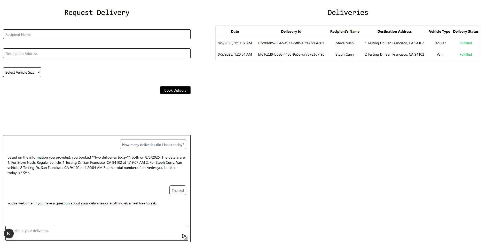

# Order/Delivery Tracking Demo

This is a demo project showcasing Inngest's [Realtime API](https://www.inngest.com/docs/features/realtime). It takes a Doordash-like approach to a delivery platform, allowing business's to book deliveries to fulfill their customer orders.

The inspiration came from helping my mom start her flower business and seeing firsthand the importance of a reliable delivery service. By using Inngest's Realtime API, businesses can monitor their deliveries as they happen and interact with a chatbot to analyze their delivery history.



Features:

- Realtime delivery status updates
- Chatbot assitance with summarizing and analyzing delivery history

## Getting Started

1. **Clone the repository:**

    ```bash
    git clone https://github.com/yimck/order-tracking-demo.git
    ```

2. **Install project dependencies:**

    ```bash
    npm i
    # or
    yarn
    # or
    pnpm i
    ```

3. **Set the OpenAI API key:**

    - If you have not yet created an OpenAI API key, go to: https://platform.openai.com/api-keys
    - Then create a `.env` folder in the project root directory and add the following:

    ```bash
    OPEN_AI_KEY=<your_api_key>
    ```

4. **Run the development server:**

    ```bash
    npm run dev
    # or
    yarn dev
    # or
    pnpm dev
    # or
    bun dev
    ```

    Open [http://localhost:3000](http://localhost:3000) with your browser to see the result.

5. **Run the Inngest development server:**

    ```bash
    npx inngest-cli@latest dev
    ```

    Open [http://localhost:8288](http://localhost:8288) with your browser to see the result.

## Notes

[Demo Notes](./Notes.pdf)